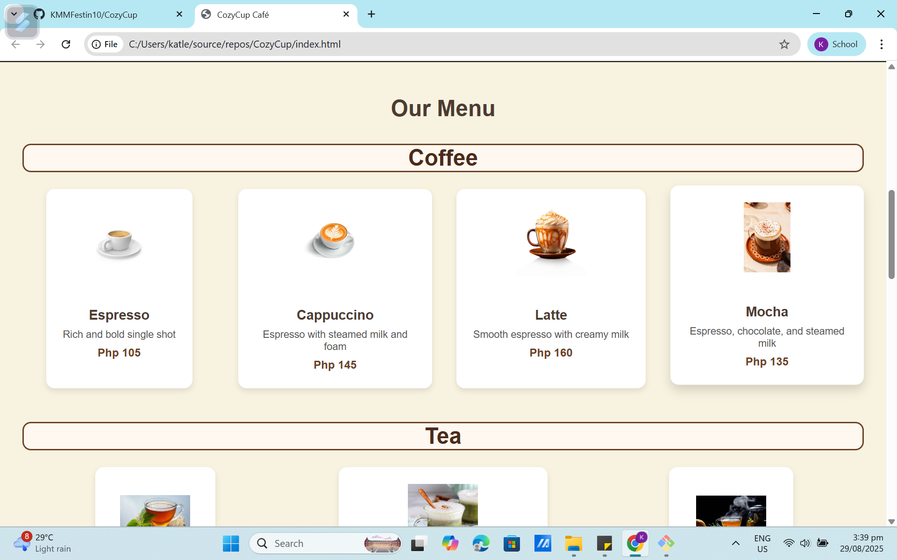

# ☕ CozyCup Café Website

Welcome to the official repository of **CozyCup Café's Website**!  
This project is a creative and responsive café webpage built using **HTML** and **CSS**.  

---

## 📌 Features  

- 🏠 **Home Section** – welcoming hero banner with café branding  
- ☕ **Menu Section** – coffee, tea, and pastries with styled typography  
- 📖 **About Us Section** – story of CozyCup with image and text  
- 📬 **Contact Us Section** – contact details and feedback form  
- 🎨 **Custom Design** – warm and cozy color palette, responsive layout  

# Screen Captures

## Screenshot 1
.png)  
*This is the Homepage.*

## Screenshot 2
  
*Menu section showcasing a variety of coffee, tea, and pastries.*

## Screenshot 3
  
*About Us page displaying CozyCup’s story with images and text.*

## Screenshot 4
.png)  
*Contact section with café details and a feedback form for customers.*

# About the Authors

Here are the authors of this project:

  

**Name:** **Joshua A. Alilano**  
**Email:** **202080138@psu.palawan.edu.ph**  
  

  

**Name:** **Katleen Mae M. Festin**  
**Email:** **202380363@psu.palawan.edu.ph**  
  

